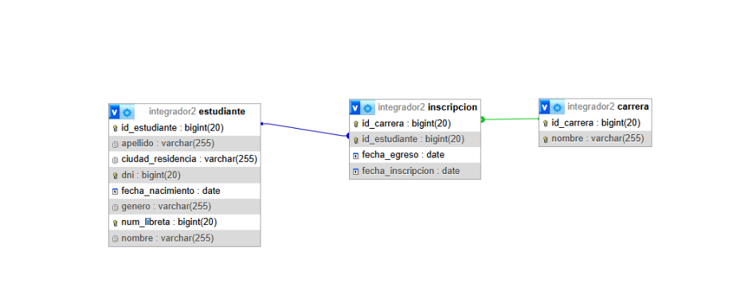
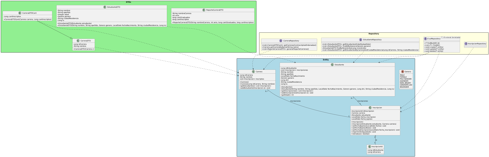

# ArqWeb-Entregables-Grupo25

## Integrantes

* Alarcos Florencia
* Azuaga Nicolas
* Wilgenhoff Adrian Ezequiel
* Loustau Carlota
* Matias Mensa

## Diagrama Entidad Relación

file: [Diagrama de Clases](Integrador2/Diagramas/DER.png)



## Diagrama de clases

file: [Diagrama de Clases](Integrador2/Diagramas/Diagrama_de_Clases.png)



-----

# Documentación de la API

Esta documentación describe los endpoints para gestionar estudiantes, carreras e inscripciones. 

# Swagger: http://localhost:8080/swagger-ui/index.html

## Estudiantes

Endpoints relacionados con la gestión de estudiantes.

### `GET` /api/v1/estudiantes/{id}

**Buscar estudiante por ID**

Busca y devuelve un estudiante específico según el ID proporcionado.

#### Parámetros de Ruta (Path)

| Clave | Valor de Ejemplo | Descripción |
| :---- | :--------------- | :---------- |
| `id`  | `5437`           | Requerido   |

-----

#### Respuestas

### Respuesta `200 OK`: Estudiante encontrado

```json
{
  "idEstudiante": 1,
  "nombre": "Juan",
  "apellido": "Pérez",
  "fechaNacimiento": "1995-10-20",
  "edad": 29,
  "genero": "FEMALE",
  "dni": 38123456,
  "ciudadResidencia": "La Plata",
  "lu": 12345
}
```

### Respuesta `404 Not Found`: Estudiante no encontrado

```json
{
  "timestamp": "1981-05-08T07:41:48.789Z",
  "status": 9184,
  "error": "string",
  "message": "string",
  "path": "string"
}
```

-----

### `PUT` /api/v1/estudiantes/{id}

**Actualizar datos de un estudiante por ID**

Modifica los datos de un estudiante existente a partir de su ID.

#### Parámetros de Ruta (Path)

| Clave | Valor de Ejemplo | Descripción |
| :---- | :--------------- | :---------- |
| `id`  | `5437`           | Requerido   |

#### Cuerpo de la Solicitud (Body)

```json
{
  "apellido": "string",
  "ciudadResidencia": "string",
  "fechaNacimiento": "2019-05-20",
  "genero": "MALE",
  "nombre": "string"
}
```

-----

#### Respuestas

### Respuesta `200 OK`: Estudiante actualizado exitosamente

```json
{
  "idEstudiante": 1,
  "nombre": "Juan",
  "apellido": "Pérez",
  "fechaNacimiento": "1995-10-20",
  "edad": 29,
  "genero": "FEMALE",
  "dni": 38123456,
  "ciudadResidencia": "La Plata",
  "lu": 12345
}
```

### Respuesta `404 Not Found`: Estudiante no encontrado

```json
{
  "timestamp": "1981-05-08T07:41:48.789Z",
  "status": 9184,
  "error": "string",
  "message": "string",
  "path": "string"
}
```

-----

### `DELETE` /api/v1/estudiantes/{id}

**Eliminar un estudiante por ID**

Elimina un estudiante del sistema basado en su ID.

#### Parámetros de Ruta (Path)

| Clave | Valor de Ejemplo | Descripción |
| :---- | :--------------- | :---------- |
| `id`  | `5437`           | Requerido   |

-----

#### Respuestas

### Respuesta `204 No Content`: Estudiante eliminado exitosamente

*(No devuelve contenido en el cuerpo de la respuesta)*

### Respuesta `404 Not Found`: Estudiante no encontrado

```json
{
  "timestamp": "1981-05-08T07:41:48.789Z",
  "status": 9184,
  "error": "string",
  "message": "string",
  "path": "string"
}
```

### Respuesta `409 Conflict`: Estudiante con inscripciones

```json
{
  "timestamp": "1981-05-08T07:41:48.789Z",
  "status": 9184,
  "error": "string",
  "message": "string",
  "path": "string"
}
```

-----

### `GET` /api/v1/estudiantes

**Obtener la lista de todos los estudiantes**

Devuelve una lista con todos los estudiantes registrados.

#### Respuestas

### Respuesta `200 OK`: Lista de estudiantes

```json
{
  "idEstudiante": 1,
  "nombre": "Juan",
  "apellido": "Pérez",
  "fechaNacimiento": "1995-10-20",
  "edad": 29,
  "genero": "FEMALE",
  "dni": 38123456,
  "ciudadResidencia": "La Plata",
  "lu": 12345
}
```

-----

### `POST` /api/v1/estudiantes

**Da de alta un estudiante**

Registra un nuevo estudiante en el sistema.

#### Cuerpo de la Solicitud (Body)

```json
{
  "apellido": "string",
  "ciudadResidencia": "string",
  "dni": 38123456,
  "fechaNacimiento": "1988-07-31",
  "genero": "BIGENDER",
  "lu": 12345,
  "nombre": "string"
}
```

-----

#### Respuestas

### Respuesta `201 Created`: Estudiante registrado exitosamente

```json
{
  "apellido": "string",
  "ciudadResidencia": "string",
  "dni": 38123456,
  "fechaNacimiento": "1988-07-31",
  "genero": "BIGENDER",
  "lu": 12345,
  "nombre": "string"
}
```

### Respuesta `400 Bad Request`: Datos de entrada inválidos

```json
{
  "timestamp": "1981-05-08T07:41:48.789Z",
  "status": 9184,
  "error": "string",
  "message": "string",
  "path": "string"
}
```

-----

### `GET` /api/v1/estudiantes/sorted

**Recupera todos los estudiantes, con criterio de ordenamiento**

Permite ordenar por un campo simple: "idEstudiante", "apellido", "nombre", "dni", "lu", "ciudadResidencia", "fechaNacimiento", "genero". Ejemplo: `?sortBy=apellido&direction=asc`.

#### Parámetros de Consulta (Query)

| Clave       | Valor de Ejemplo |
| :---------- | :--------------- |
| `sortBy`    | `id`             |
| `direction` | `asc`            |

-----

#### Respuestas

### Respuesta `200 OK`: Lista de estudiantes

```json
{
  "idEstudiante": 1,
  "nombre": "Juan",
  "apellido": "Pérez",
  "fechaNacimiento": "1995-10-20",
  "edad": 29,
  "genero": "FEMALE",
  "dni": 38123456,
  "ciudadResidencia": "La Plata",
  "lu": 12345
}
```

-----

### `GET` /api/v1/estudiantes/lu/{lu}

**Recupera un estudiante por su número de libreta universitaria (LU)**

Busca y devuelve un estudiante por su número de LU.

#### Parámetros de Ruta (Path)

| Clave | Valor de Ejemplo | Descripción |
| :---- | :--------------- | :---------- |
| `lu`  | `5437`           | Requerido   |

-----

#### Respuestas

### Respuesta `200 OK`: Estudiante encontrado

```json
{
  "idEstudiante": 1,
  "nombre": "Juan",
  "apellido": "Pérez",
  "fechaNacimiento": "1995-10-20",
  "edad": 29,
  "genero": "FEMALE",
  "dni": 38123456,
  "ciudadResidencia": "La Plata",
  "lu": 12345
}
```

### Respuesta `404 Not Found`: Estudiante no encontrado

```json
{
  "timestamp": "1981-05-08T07:41:48.789Z",
  "status": 9184,
  "error": "string",
  "message": "string",
  "path": "string"
}
```

-----

### `GET` /api/v1/estudiantes/genero/{genero}

**Recuperar todos los estudiantes por género**

Filtra y devuelve una lista de estudiantes que coincidan con el género especificado.

#### Parámetros de Ruta (Path)

| Clave    | Valor de Ejemplo | Descripción |
| :------- | :--------------- | :---------- |
| `genero` | `BIGENDER`       | Requerido   |

-----

#### Respuestas

### Respuesta `200 OK`: Lista filtrada de estudiantes

```json
{
  "idEstudiante": 1,
  "nombre": "Juan",
  "apellido": "Pérez",
  "fechaNacimiento": "1995-10-20",
  "edad": 29,
  "genero": "FEMALE",
  "dni": 38123456,
  "ciudadResidencia": "La Plata",
  "lu": 12345
}
```

-----

### `GET` /api/v1/estudiantes/carreras/{carreraId}/ciudad/{ciudad}

**Recupera estudiantes de una carrera filtrado por ciudad**

Busca estudiantes inscriptos en una carrera específica y que residan en una ciudad determinada.

#### Parámetros de Ruta (Path)

| Clave       | Valor de Ejemplo | Descripción | 
| :---------- | :--------------- | :---------- |
| `carreraId` | `5437`           | Requerido   | 
| `ciudad`    | `string`         | Requerido   |

#### Respuestas

### Respuesta `200 OK`

```json
[
  {
    "idEstudiante": 1,
    "nombre": "Juan",
    "apellido": "Pérez",
    "fechaNacimiento": "1995-10-20",
    "edad": 29,
    "genero": "AGENDER",
    "dni": 38123456,
    "ciudadResidencia": "La Plata",
    "lu": 12345
  }
]
```

## Carreras

Endpoints relacionados con la gestión de carreras.

### `GET` /api/v1/carreras/{id}

**Buscar carrera por ID**

Busca y devuelve una carrera específica según el ID proporcionado.

#### Parámetros de Ruta (Path)

| Clave | Valor de Ejemplo | Descripción | 
| :---- | :--------------- | :---------- | 
| `id`  | `5437`           | Requerido   |

#### Respuestas

### Respuesta `200 OK`: Carrera encontrada

```json
{
  "idCarrera": 10,
  "nombre": "Ingeniería de Sistemas",
  "duracion": 5
}
```

### Respuesta `404 Not Found`: Carrera no encontrada

```json
{
  "timestamp": "1981-05-08T07:41:48.789Z",
  "status": 9184,
  "error": "string",
  "message": "string",
  "path": "string"
}
```

-----

### `POST` /api/v1/carreras

**Crear una nueva carrera**

Registra una nueva carrera en el sistema.

#### Cuerpo de la Solicitud (Body)

```json
{
  "duracionAnios": 12,
  "nombre": "string"
}
```

-----

#### Respuestas

### Respuesta `201 Created`: Carrera creada exitosamente

```json
{
  "duracionAnios": 12,
  "nombre": "string"
}
```

### Respuesta `400 Bad Request`: Datos de entrada inválidos

```json
{
  "timestamp": "1981-05-08T07:41:48.789Z",
  "status": 9184,
  "error": "string",
  "message": "string",
  "path": "string"
}
```

-----

## Inscripciones

Endpoints para gestionar las inscripciones de estudiantes a carreras.

### `POST` /api/v1/inscripciones/matricular

**Inscribir a un estudiante en una carrera**

Matricula a un estudiante en una carrera específica.

#### Cuerpo de la Solicitud (Body)

```json
{
  "carreraId": 7,
  "estudianteId": 1
}
```

-----

#### Respuestas

### Respuesta `200 OK`: Estudiante inscripto en la carrera

```json
{
  "carreraId": 7,
  "estudianteId": 1
}
```

### Respuesta `409 Conflict`: Inscripción duplicada

```json
{
  "timestamp": "1981-05-08T07:41:48.789Z",
  "status": 9184,
  "error": "string",
  "message": "string",
  "path": "string"
}
```
